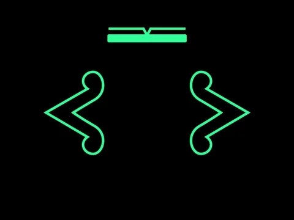
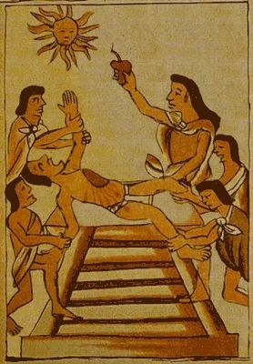
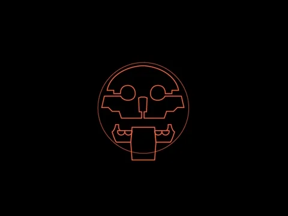

# :shinto_shrine: Mayas y aztecas

## Introducción ##

Resulta que, hace mucho tiempo, encontraron un azteca y un maya sendas fórmulas, la del Cola Cao y del Nesquik, respectivamente.

Ambos se hicieron una ofrenda, para probar el descubrimiento del opuesto, y descubrieron que les gustaba más el descubrimiento del otro.

-- ¡¿Cómo era posible que los "grumitos" molaran tanto?!

Decía uno.

-- ¡¿Cómo es posible que, incluso con la leche fría, se disolviera tan fácilmente?!

Pensaba el otro.

Comenzó, desde entonces, una lucha legendaria entre ambos pueblos, que se extendió al resto del mundo hasta nuestros días.

## Requisitos ##

- Precurso Web

- Javascript orientado a objetos

## Iteraciones ##

El ejercicio en cuestión será de cómo, cierto día, intentaron resolver "a golpes" su disputa.

1. Construye las siguientes clases:

    **Warrior**:

    `constructor(life, power)`: Establece el valor de las propiedades _life_ y _power_

    `attack`: Devuelve el valor de _power_ del guerrero

    `defend(damage)`: resta el valor del parámetro recibido _damage_ al valor de la propiedad _life_. Después, imprime el valor de la vida restante.

    **Maya: extiende de la clase Warrior**

    `constructor`: Aquí establecemos los valores para el maya, que no hay que olvidar que es un guerrero.

    `drinkColaCao`: Suma 10 al poder.

    **Aztec: extiende de la clase Warrior**

    `constructor`: Aquí establecemos los valores para el azteca, que no hay que olvidar que es un guerrero.

    `drinkNesquik`: Suma 10 a la vida.

3. Realiza la siguiente cadena de intercambio de golpes.

    - Azteca bebe nesquik

    - Maya bebe Cola Cao

    - Maya ataca a azteca. Azteca defiende.

    - Azteca ataca a maya. Maya defiende.
